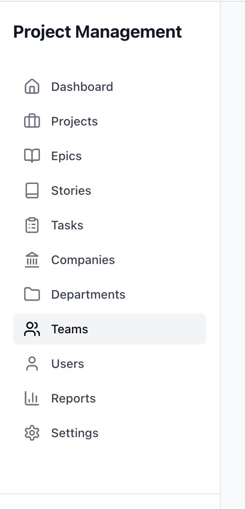
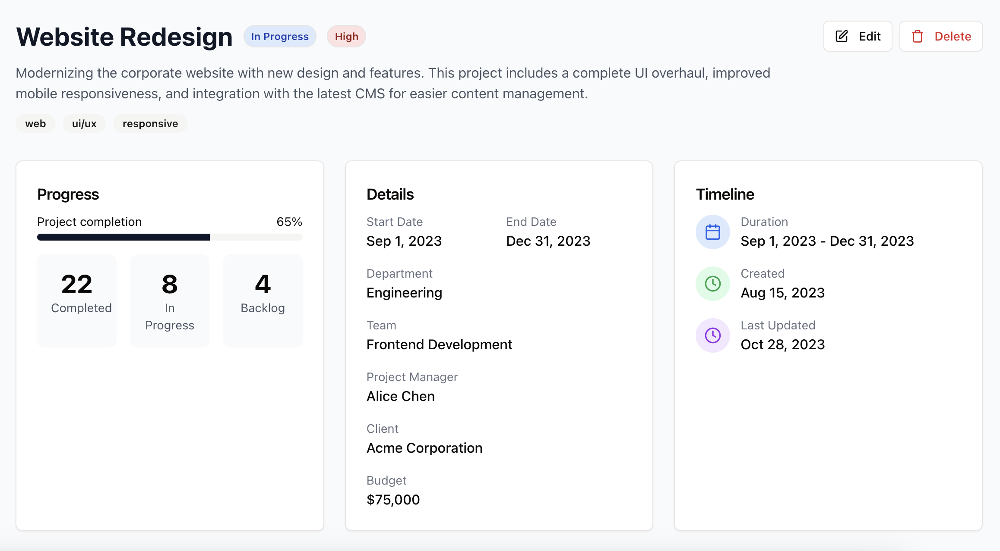

## Frontend Components

The application features a responsive UI with:

- Modern card-based design
- Interactive Kanban boards
- Progress tracking visualizations
- Batch selection and operations
- Advanced filtering and search
- Role-specific views and actions

## Screenshots

### Project Dashboard

### Task Management

